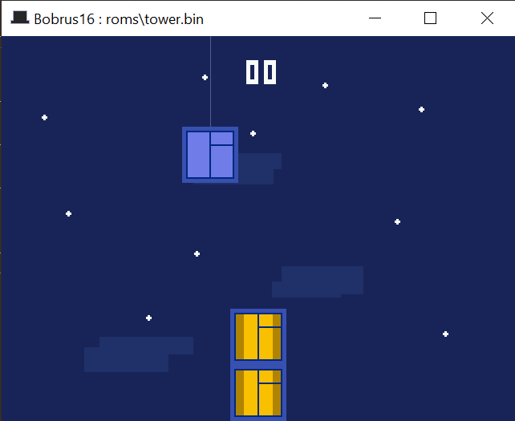

</img>


Implementation of [Brus-16](https://github.com/true-grue/Brus-16) in Umka.  Use [tophat](http://github.com/tophat2d/tophat) to launch.

```sh
tophat <rom>
```

ROMS included in `roms/` and they all belong to the original creator @true-grue / Peter Sovietov.

P.S. Thanks to the creator for including Tower Bloxx clone.
I used to play it on Nokia as a kid :D

I only really got motivated when I saw that game, so I wrote this overnight.